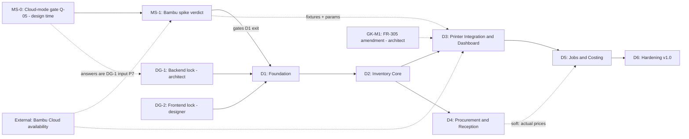

# PROJECT PLAN: GeekBOX Print Management
**Version**: 2.0 (revision — attempt-1 findings M1, M2 and minors m1–m5 addressed)
**Authors**: planner (Supreme Team design pipeline, Phase 2)
**Status**: Revised (attempt 2)
**Date**: 2026-08-04
**Source Requirements**: `../phase-1_researcher/deliverable_srs.md` (SRS v1.0, gatekeeper-design APPROVED, 84/100) and `../phase-1_researcher/deliverable_domain-analysis.md`

> **Naming note**: Delivery phases are labeled **D1–D6** and milestones **MS-0–MS-7** to avoid collision with design-pipeline phase numbers and with gatekeeper finding IDs (the carried-forward Major finding is referenced as **GK-M1** throughout).

---

## 1. Executive Summary

A solo owner-operator gets a self-hosted (Docker Compose, no cloud spend), single-user web application that is a lightweight ERP for 3D printing: filament catalog and per-spool inventory with a weight ledger, purchase orders and inbound tracking, goods reception, a live Bambu Lab printer dashboard (unofficial cloud REST + MQTT behind an anti-corruption layer), and cost-per-print derived from actual consumption. Delivery is phased in dependency order as six thin, independently shippable slices totaling roughly **13–18.5 cumulative effort-weeks** (effort, not calendar — calendar duration scales with the part-time cadence in §9; range, not commitment). The single largest risk — that every Bambu API fact is community-documented and unverified (A-01…A-05) — is front-loaded twice: **the cloud-mode question (MS-0 / Q-05, plus Q-01/Q-02/Q-06) is posed immediately at design time — at design Phase 3 entry at latest — with the recorded answers feeding DG-1; the Bambu API verification spike (MS-1) is then the very first build activity**. Technology stacks are deliberately NOT chosen here; this plan defines the decision gates (backend lock at design Phase 3 / architect, frontend lock at design Phase 4 / designer) and the prerequisites each gate must satisfy.

---

## 2. Scope Summary

### In Scope (from approved SRS)
- 32 functional requirements: FR-001–003 (auth), FR-101–108 (inventory), FR-201–207 (procurement/inbound/reception), FR-301–308 (Bambu integration & dashboard), FR-401–406 (jobs & costing). **29 MUST, 3 SHOULD** (SHOULDs: FR-003, FR-108, FR-207 — per-FR sweep of SRS §3).
- 28 NFRs with measurable thresholds (SRS §4), right-sized for single-user LAN self-hosting.
- 5 bounded contexts (SRS §6.1): Filament Inventory, Procurement & Reception, Print Jobs & Costing (core); Printer Integration ACL (supporting); Identity & Access (generic).

### Out of Scope (reaffirmed — any of these appearing later is scope creep, see RISK-006)
Multi-user/RBAC, sales/invoicing, slicer/file management, print initiation or remote control, non-Bambu printers, accounting-grade financials, native mobile apps, cloud/SaaS deployment, automated vendor ordering (SRS §1.4, §9).

### Planning Assumptions
- A-01…A-08 from SRS §7.2 carried forward unchanged; A-01…A-05 (all Bambu API facts) are the top planning risk and are resolved at MS-1, not assumed resolved by this plan.
- Solo developer wearing all hats; effort figures are ideal-focus estimates with ranges (no fixed calendar dates — capacity is a tracked risk, RISK-004).
- No external deadline exists; sequencing optimizes for risk retirement and early usable value, not date attainment.
- Design pipeline Phases 3–5 (architect, designer, engineer) complete before build starts; delivery phases D1–D6 below are **build/implementation phases** consumed later by build-management.

### Carried-Forward Gatekeeper Inputs (from phase-1 verdict — explicitly scheduled)
| Item | What | Where resolved in this plan |
|------|------|-----------------------------|
| **GK-M1** (Major) | External-spool designation is MUST-path behavior (FR-402) with no defining FR; mechanism exists only in domain analysis §4 (AmsSlotMapping virtual external-spool slot) | Design Phase 3 (architect) amends FR-305 with an explicit external-spool-holder mapping AC per printer (mechanism per DA §4); implemented in delivery Phase D3; exit criterion of MS-4. See §3 D3 and §8 DG-1 prerequisite P5. |
| **Q-05** (blocker) | Printers must be in Bambu **cloud mode** (not LAN-only) or the cloud API returns nothing | **MS-0 design-time gate** — commander poses Q-05 (with Q-01/Q-02/Q-06) immediately, at design Phase 3 entry at latest; recorded answers are a DG-1 input (prerequisite P7). MS-1 spike stays at build start. See §4 MS-0 and RISK-002. |
| m1–m4 (Minor) | Packet count errors; entity-summary drift (CloudLink/AmsSlotMapping); ES-107.1 unresolved alternative; FR-102↔FR-205 circular dependency note | Assigned to architect (design Phase 3) as opportunistic documentation fixes; ES-107.1 must be resolved to ONE behavior in the architecture spec (recommended: atomic unmap-then-archive after confirmation, matching DA §4 "unmap AMS first"). No re-review cycle required per gatekeeper. |
| m5 (Minor) | NFR-US-03 soft measurement | Designer (design Phase 4) to define an inspectable criterion (e.g., freshness timestamp element present on every live value component). |

---

## 3. Phase Breakdown (Delivery Phases D1–D6)

Decomposition rationale: the architectural spine (compose skeleton, DB, auth, CI) plus the highest-risk unknown (Bambu API) form D1. Remaining scope is clustered into independently deployable value slices and ordered by risk × value: inventory is the book of record everything joins to (D2); printer integration is the highest-residual-risk core value and needs spools to map against (D3); procurement/reception is lower-risk CRUD+transactional work (D4); jobs & costing joins everything and must come last (D5); hardening closes NFR verification (D6). Each phase ends deployable and useful on its own.

---

## Phase D1: De-Risk & Foundation
**Duration**: 1.5–2.5 weeks (spike: 2–4 days of that)
**Goal**: Retire the Bambu API assumption risk with recorded evidence, and stand up the walking skeleton every later phase builds on.
**Deliverables**:
  - **MS-0 gate record (input — produced at design time, not here)**: user confirmation that printer(s) are in Bambu cloud mode (Q-05), plus answers to Q-01 (MQTT region), Q-02 (printer models/AMS count), Q-06 (MFA/code login) gathered in the same exchange at design Phase 3 entry (at latest) and recorded as a DG-1 input; D1 verifies the record exists before spike work begins
  - **Bambu API verification spike** (throwaway scripts, NOT product code): exercise login (A-01, incl. verification-code path if triggered), device bind (A-02), MQTT connect/subscribe `device/{serial}/report` (A-03), task history fetch (A-04); observe rate-limit behavior conservatively (A-05)
  - **Spike report**: per-assumption VERIFIED / PARTIAL / FAILED verdict + **recorded, redacted payload fixtures** (login response, bind response, ≥ 3 report messages incl. AMS block, tasks response) — these fixtures become the ACL contract-test corpus (NFR-MA-01/02/03)
  - Repository scaffold per architect's structure; CI pipeline (lint → test → build → image)
  - Docker Compose skeleton: app + DB services, named volumes (NFR-PO-01/02), restart policy (NFR-RE-01)
  - Initial DB migration baseline; first-run account setup, login, session management, logout, throttling (FR-001–003; NFR-SE-01/04/06/07)
**Requirements covered**: FR-001, FR-002, FR-003; spike evidence for A-01…A-05
**Dependencies**: Design pipeline complete (backend lock DG-1, frontend lock DG-2 — see §8); **MS-0 record already captured at design time (hard blocker for spike work if missing; never a blocker for scaffolding — scaffolding may proceed in parallel with the spike)**
**Exit criteria**: MS-0 recorded; spike report exists with a verdict per assumption A-01…A-05 and fixtures committed; **go/no-go checkpoint passed** (see MS-1 decision rule, §4); `docker compose up -d` on a clean host yields a login-protected empty app; CI green

> **MS-1 decision rule**: If any of A-01…A-04 is FAILED, the architect is re-engaged to adopt the corresponding fallback already specified in SRS §7.2 (manual token supply, manual serial entry, REST-poll fallback, manual/MQTT-only usage capture) **before** D3 is planned in detail. A FAILED A-01+A-03 together triggers user escalation with a descope option (integration reduced to manual job entry; app remains fully valuable per NFR-RE-05). This is a bounded architecture amendment, not a pipeline restart — the ACL boundary (NFR-MA-02) exists precisely to keep this blast radius inside one module.

---

## Phase D2: Inventory Core
**Duration**: 2–3 weeks
**Goal**: The book of record works end-to-end: products, vendors, spools, immutable weight ledger, stock views, low-stock alerts. App is genuinely useful from this point on (manual tracking).
**Deliverables**:
  - Vendor CRUD/archive (FR-201 — pulled forward because FilamentProduct requires vendorId)
  - Filament product catalog with archive-instead-of-delete (FR-101)
  - Manual spool registration, spool lifecycle states (FR-102, FR-107 — reception-sourced spools arrive in D4; AMS-triggered in_use arrives in D3)
  - Spool weight ledger: immutable entries, atomic balance updates, floor-at-zero + over-consumption flag + auto-deplete (FR-103); manual adjustment/recalibration with tare handling (FR-104)
  - Stock level views with filters and drill-down (FR-105); inventory valuation snapshot (FR-108)
  - Low-stock thresholds, alert panel, auto-clear (FR-106 — **except AC-106.3 on-order annotation, which lands in D4 with POs**)
  - Domain test rigor per NFR-MA-01: ledger invariants under property/crash-injection tests (NFR-RE-03)
**Requirements covered**: FR-101, FR-102 (manual path), FR-103, FR-104, FR-105, FR-106 (partial — AC-106.3 deferred to D4), FR-107 (partial — AMS transition in D3), FR-108, FR-201
**Dependencies**: D1 complete (auth, DB, CI)
**Exit criteria**: All listed ACs pass except explicitly deferred ones; ledger atomicity crash test passes; a real spool can be tracked from registration through manual deduction to depletion

---

## Phase D3: Printer Integration & Live Dashboard
**Duration**: 3–4 weeks
**Goal**: The unstable external dependency is productized inside the ACL: account linking, discovery, persistent MQTT listener, live dashboard, AMS↔spool mapping including the external-spool holder (**GK-M1 resolution implemented here**).
**Deliverables**:
  - Bambu account linking with verification-code path, encrypted token storage (FR-301; NFR-SE-02/03/05)
  - Printer discovery + tracked-printer selection, manual-serial fallback if A-02 was PARTIAL/FAILED (FR-302)
  - Persistent MQTT listener service (long-running, per C-02), normalization to TelemetrySnapshot, schema-drift tolerance (FR-303; NFR-MA-03, NFR-PE-03)
  - Live dashboard: printer cards, progress/layers/time/temps, staleness flagging, integration-degraded banner (FR-304; NFR-PE-02, NFR-US-03)
  - AMS panel + slot↔spool mapping with verify-mapping flag, **plus per-printer virtual external-spool-holder mapping (amended FR-305 per GK-M1)**; mapping drives spool in_use/in_stock transitions (FR-305, FR-107 remainder)
  - Reconnect with exponential backoff + jitter, integration health panel (FR-306; NFR-RE-02); token-expiry → reauth-required flow with full core-app independence (FR-307; NFR-RE-05)
  - ACL contract tests running against the D1 recorded fixtures; static check: zero Bambu imports outside the adapter (NFR-MA-02)
**Requirements covered**: FR-301–FR-307 (incl. amended FR-305), FR-107 (AMS transitions)
**Dependencies**: D2 (spools to map), MS-1 spike verdict (connection parameters, payload shapes, fixtures); external: Bambu cloud availability
**Exit criteria**: A real print on the user's printer appears live on the dashboard within the 10 s freshness threshold; AMS slots and the external holder map to real spools; kill-network and token-expiry drills pass (NFR-RE-02, FR-307 ACs); inventory/procurement features verified functional with integration forcibly disabled (NFR-RE-05)

---

## Phase D4: Procurement, Inbound & Goods Reception
**Duration**: 2–3 weeks
**Goal**: "Filament on the way" is visible and reception books spools into stock atomically — the procurement→inventory bridge is complete.
**Deliverables**:
  - PO creation with line items, totals, draft editing rules (FR-202)
  - PO status lifecycle with derived partial/received states and timestamped transitions (FR-203)
  - Inbound overview with ETA sorting, overdue flagging, no-ETA handling (FR-204)
  - Goods-reception workflow: atomic receipt + spool creation + PO status update + alert re-evaluation (FR-205; NFR-RE-03 crash test around the posting transaction); reception-sourced spool registration path (FR-102 remainder)
  - Partial receipts with serialized concurrent postings (FR-206); discrepancy notes incl. damaged-spool handling (FR-207)
  - Low-stock alert on-order annotation (FR-106 AC-106.3 closure)
**Requirements covered**: FR-202–FR-207, FR-102 (reception path), FR-106 (AC-106.3)
**Dependencies**: D2 (products, spools, alerts). Independent of D3 — can be reordered ahead of D3 with no dependency breakage if MS-1 outcomes force architect rework (built-in schedule flexibility).
**Exit criteria**: Full walkthrough: create PO → mark ordered → appears inbound → partial reception → spools in stock with prices → PO auto-completes on final reception; reception crash-injection test passes; reception of a spool batch ≤ 2 min (SRS success metric)

---

## Phase D5: Print Jobs & Costing
**Duration**: 3–4 weeks
**Goal**: The headline outcome: every print gets a cost, consumption flows into the spool ledger exactly once.
**Deliverables**:
  - Task history sync, idempotent upsert keyed by Bambu task ID (FR-308 — conservative 30 min polling per A-05)
  - Print job records with dual-source (MQTT + task API) merge policy (FR-401)
  - Consumption deduction to mapped spools with (job, slotRef) idempotency guard; length→weight density conversion marked "estimated"; unattributed-usage capture and later assignment (FR-402) — **shipped behind a preview flag: deductions computed and displayed as "pending" before auto-posting is enabled** (see §7 feature-flag lifecycle)
  - Cost rate configuration (FR-403), cost-per-print snapshots with frozen inputs + explicit recalculation (FR-404)
  - Manual job entry and reverse-and-repost corrections (FR-405)
  - Job history view with filters, summaries, CSV export (FR-406)
**Requirements covered**: FR-308, FR-401–FR-406
**Dependencies**: D2 (ledger), D3 (mappings, telemetry, task sync auth), D4 (spool purchase prices for unit cost — product-default fallback exists, so D4 is a soft dependency)
**Exit criteria**: A real print completes and, without manual action, appears as a job with attributed consumption deducted once and a stored cost snapshot; re-sync produces no duplicates or double deductions (AC-308.2, AC-402.2); ≥ 95% of completed prints during the phase's soak week receive a computed cost (SRS success metric); preview flag graduated to auto-post after one week of verified-correct pending deductions

---

## Phase D6: Hardening & v1.0 Release
**Duration**: 1.5–2 weeks
**Goal**: NFR thresholds verified with evidence; backup/restore proven; documented v1.0 tagged.
**Deliverables**:
  - Seeded-data performance run (5,000 spools / 10,000 jobs / 100,000 ledger entries) vs. NFR-PE-01; MQTT replay load test vs. NFR-PE-03; 24 h soak vs. NFR-PE-04
  - Security pass: route-table auth audit + unauthenticated probes (NFR-SE-06), image/secret scan (NFR-SE-05), brute-force test (NFR-SE-07), token-at-rest inspection (NFR-SE-02)
  - Backup → wipe → restore drill (NFR-RE-04); kill-container recovery test (NFR-RE-01)
  - Accessibility and responsive audit on core flows (NFR-US-01/02); cross-browser smoke (NFR-CO-01)
  - README: setup, backup/restore, Bambu re-linking, integration limitations (NFR-MA-04)
  - v1.0 tagged images + release checklist executed (§7)
**Requirements covered**: All NFRs verified; no new FRs
**Dependencies**: D1–D5 complete
**Exit criteria**: Every NFR row has a recorded measurement meeting its threshold or a user-accepted, documented deviation; restore drill succeeded on a clean host; v1.0 images tagged and running as the user's daily instance

---

## 4. Milestone Map

No fixed calendar dates (solo capacity, no external deadline — RISK-004/RISK-010). Targets are expressed as cumulative effort ranges from build start; sequence is binding, dates are not.

| ID | Milestone | Target (cumulative) | Dependencies | Acceptance Criteria |
|----|-----------|--------------------|--------------|---------------------|
| MS-0 | Cloud-mode confirmed (Q-05) + Q-01/Q-02/Q-06 answered | **Design time — design Phase 3 entry at latest** (well before build week 0) | Commander poses questions to user | Written confirmation recorded in run artifacts as a DG-1 input (P7); region + models known |
| MS-1 | Bambu API assumptions verified | Week 1 | MS-0 | Spike report with per-assumption verdict; redacted fixtures committed; go/no-go decision recorded per D1 decision rule |
| MS-2 | Foundation complete | Week 1.5–2.5 | MS-1 (go), DG-1/DG-2 locked | Clean-host `docker compose up -d` → login works; CI green; migration baseline applied |
| MS-3 | Inventory usable end-to-end | Week 3.5–5.5 | MS-2 | D2 exit criteria; user tracking ≥ 1 real spool in daily use |
| MS-4 | Live dashboard + AMS/external-spool mapping (**GK-M1 closed**) | Week 6.5–9.5 | MS-3, MS-1 fixtures | D3 exit criteria; amended FR-305 ACs pass incl. external holder |
| MS-5 | Procurement→stock flow complete | Week 8.5–12.5 | MS-3 | D4 exit criteria; one real PO received into stock |
| MS-6 | Cost-per-print end-to-end | Week 11.5–16.5 | MS-4, MS-5 (soft) | D5 exit criteria; auto-post flag graduated |
| MS-7 | v1.0 hardened release | Week 13–18.5 | MS-6 | D6 exit criteria; all NFR evidence recorded; v1.0 tagged |

---

## 5. Risk Register

Scoring per Probability (1–3) × Impact (1–3); see planner risk guide matrix.

### RISK-001: Bambu API assumptions are unverified and may be wrong
**Category**: External | **Probability**: High (3) | **Impact**: High (3) | **Risk Score**: 9 — Critical
**Description**: All integration facts (A-01…A-05: login endpoint/flow, device bind, MQTT broker/auth/topic, task history incl. filament usage, tolerance of third-party clients) come from community documentation with no stability contract. Any of them may be wrong today or break tomorrow; FR-301–FR-308 and automatic costing all sit on them.
**Mitigation**: MS-0/MS-1 front-loaded verification spike before any integration product code; recorded fixtures become the permanent contract-test corpus; ACL with zero-Bambu-imports rule (NFR-MA-02) confines blast radius to one module; conservative polling (≤ 1 req/min/endpoint, 30 min task sync) reduces provocation of anti-client measures.
**Contingency**: Per-assumption fallbacks pre-approved in SRS §7.2 (manual token supply, manual serial entry, MQTT-only or manual usage capture); D1 decision rule triggers bounded architect re-engagement; full descope of integration leaves a still-valuable manual system (NFR-RE-05 guarantees this by test).
**Owner**: Solo dev (architect consulted at MS-1) | **Review cadence**: At MS-1, then start of every delivery phase; immediately on any integration failure in daily use.

### RISK-002: Printers are LAN-only (Q-05 answer is "no")
**Category**: External | **Probability**: Medium (2) | **Impact**: High (3) | **Risk Score**: 6 — High
**Description**: If the user's printers are not in Bambu cloud mode, the cloud API sees nothing; D3/D5 automation is void. LAN-mode MQTT is explicitly out of v1 scope.
**Mitigation**: MS-0 is a hard **design-time** gate — the question costs nothing to answer and is posed immediately (design Phase 3 entry at latest), *before* any architect/designer integration design effort (FR-301–308 architecture, dashboard design, DG-3/DG-4/DG-6) is spent, not merely before build; the recorded answer is a DG-1 input (P7). Enabling cloud mode on the printer is usually a settings change, making the fix cheap if caught now.
**Contingency**: If user declines cloud mode: escalate for a scope decision — (a) user switches printers to cloud mode, or (b) v1 descopes to manual jobs/consumption (D3 reduced to nothing, D5 keeps FR-401 — job records via manual entry — plus FR-403–FR-406) with LAN integration logged as v2 candidate.
**Owner**: Commander (user-facing question) → solo dev | **Review cadence**: One-time gate at MS-0 (design Phase 3 entry).

### RISK-003: Bambu API drifts or blocks third-party access mid-project or post-launch
**Category**: External | **Probability**: Medium (2) | **Impact**: Medium (2) | **Risk Score**: 4 — Medium
**Description**: Distinct from RISK-001 (initial correctness): the API may change schema, endpoints, auth, or actively restrict third-party clients after integration works. (Impact Medium, not High, because NFR-RE-05 caps the damage at loss of automation.)
**Mitigation**: Schema-drift tolerance by construction (unknown fields ignored, missing → "unknown", NFR-MA-03); contract tests against fixtures detect drift at CI time; integration health panel surfaces breakage immediately (FR-306); reauth flow isolates auth changes (FR-307).
**Contingency**: Refresh fixtures from live traffic, patch adapter only; if permanently blocked, fall back to manual job entry (FR-405) — core app unaffected.
**Owner**: Solo dev | **Review cadence**: Each phase start + on any health-panel alert.

### RISK-004: Solo-developer capacity, continuity, and motivation
**Category**: Resource | **Probability**: Medium (2) | **Impact**: Medium (2) | **Risk Score**: 4 — Medium
**Description**: One person does everything; illness, day-job load, or waning interest stalls the project. No fixed dates exist to slip, but a long stall risks abandonment.
**Mitigation**: Every phase ends independently deployable and personally useful (D2 already replaces the spreadsheet) — value accrues even if the project pauses; thin vertical slices keep restart cost low; CI + tests + README (NFR-MA-04) preserve context across gaps.
**Contingency**: Pause at any phase boundary with a tagged, working release; SHOULD-priority FRs (FR-003, FR-108, FR-207) are the pre-agreed first descope candidates.
**Owner**: Solo dev | **Review cadence**: Each milestone.

### RISK-005: Transactional-correctness defects in ledger/reception/consumption
**Category**: Technical | **Probability**: Medium (2) | **Impact**: High (3) | **Risk Score**: 6 — High
**Description**: The spool ledger is the book of record. Bugs in atomicity (FR-205 reception posting, FR-103 deductions), idempotency (FR-402), or reversal logic (FR-405) silently corrupt inventory and every cost derived from it — the exact failure the product exists to prevent.
**Mitigation**: Highest test rigor on core contexts (NFR-MA-01 ≥ 80%, invariant/property tests on ledger rules); crash-injection tests around reception and consumption posting (NFR-RE-03) are phase exit criteria, not afterthoughts; D5 consumption ships in preview mode before auto-posting (see §7).
**Contingency**: Manual recalibration (FR-104) provides user-level repair for any drift; immutable ledger + reversal-only corrections make every error auditable and reversible; backup/restore (NFR-RE-04) bounds worst case.
**Owner**: Solo dev | **Review cadence**: D2, D4, D5 exit reviews.

### RISK-006: Scope creep — "almost a complete ERP" invites expansion
**Category**: Schedule | **Probability**: High (3) | **Impact**: Medium (2) | **Risk Score**: 6 — High
**Description**: The ERP framing naturally suggests sales, invoicing, multi-printer fleets, charts, LAN mode, slicer hooks. Solo capacity makes creep fatal to completion.
**Mitigation**: SRS §1.4/§9 out-of-scope list is the contract; lightweight change control (right-sized, no board): any feature not traceable to an FR goes to a `v2-backlog.md`, never into the current phase; gatekeeper reviews check phase deliverables against FR coverage only.
**Contingency**: If the user requests in-flight scope changes, commander re-engages researcher/planner for an explicit SRS/plan amendment with visible schedule impact — no silent absorption.
**Owner**: Solo dev (self-discipline) + gatekeepers | **Review cadence**: Each phase exit.

### RISK-007: Dual-source job duplication / double deduction
**Category**: Technical | **Probability**: Medium (2) | **Impact**: Medium (2) | **Risk Score**: 4 — Medium
**Description**: The same physical print is visible via MQTT and task sync (hot spot H2). Merge or idempotency defects create duplicate jobs or double ledger deductions.
**Mitigation**: Merge-by-task-ID (+ printer/time-window fallback) and (job, slotRef) idempotency guard are designed-in invariants (FR-401/402) with dedicated re-sync tests (AC-308.2, AC-402.2) as D5 exit criteria; preview flag lets duplicates be observed before they touch the ledger.
**Contingency**: Reverse-and-repost correction flow (FR-405) repairs any escaped duplicate with full audit trail.
**Owner**: Solo dev | **Review cadence**: D5 exit + first month of live use.

### RISK-008: MQTT listener long-run instability (leaks, reconnect storms, queue growth)
**Category**: Technical | **Probability**: Medium (2) | **Impact**: Medium (2) | **Risk Score**: 4 — Medium
**Description**: A persistent listener that runs for months is a different beast than one that passes a demo: memory growth, unbounded queues under message bursts, or pathological reconnect loops degrade the host (1 GB cap, NFR-PE-04).
**Mitigation**: Backoff with jitter and hard cap (FR-306); bounded ingestion queue with drop-oldest semantics (latest-snapshot model makes dropping safe, Q-04); 24 h soak with container stats and replay load test are D6 gates (NFR-PE-03/04).
**Contingency**: Compose restart policy auto-heals crashes (NFR-RE-01); listener isolation (own service or supervised task per DG-4) prevents core-app impact; health panel exposes degradation.
**Owner**: Solo dev | **Review cadence**: D3 exit, D6 soak, then monthly in operation.

### RISK-009: Bambu credential/token exposure on the self-hosted box
**Category**: Security | **Probability**: Low (1) | **Impact**: High (3) | **Risk Score**: 3 — Medium
**Description**: The app stores tokens for the user's real Bambu account; a compromised host or leaked backup exposes them. LAN-only deployment lowers probability; account takeover keeps impact high.
**Mitigation**: Tokens encrypted at rest with key from env/secret file, account password never persisted (NFR-SE-02); no secrets in images/logs (NFR-SE-05) verified by scan in D6; all routes session-gated (NFR-SE-06); TLS with cert verification to Bambu (NFR-SE-03).
**Contingency**: Unlink flow deletes tokens (AC-301.3); user rotates Bambu password (invalidates tokens); backups documented as sensitive in README.
**Owner**: Solo dev | **Review cadence**: D6 security pass + any dependency-audit alert.

### RISK-010: Estimation error on a first-time integration
**Category**: Schedule | **Probability**: Medium (2) | **Impact**: Low (1) | **Risk Score**: 2 — Low
**Description**: D3/D5 estimates involve a never-before-integrated API; the "double first-time integration estimates" rule is already applied, but ranges may still be optimistic. With no external deadline, impact is limited to expectation management.
**Mitigation**: Ranges not dates; 20–25% buffer inside phase ranges; milestone map declares sequence binding, dates not; re-estimate at each phase exit using actuals.
**Contingency**: Slips surface at milestone reviews with options (descope SHOULDs, extend, pause at a shippable boundary) — never silently absorbed.
**Owner**: Solo dev | **Review cadence**: Each milestone.

**Ranked by score**: RISK-001 (9 — Critical); RISK-002, RISK-005, RISK-006 (6 — High); RISK-003, RISK-004, RISK-007, RISK-008 (4 — Medium); RISK-009 (3 — Medium); RISK-010 (2 — Low).

---

## 6. Dependency Graph

**Edge semantics**: MS-0 is a design-time gate — its answers feed DG-1 (P7) and unblock the MS-1 spike. The MS-1 → D1 edge gates D1 *completion* (exit criteria) and detailed D3 planning, not D1 start: scaffolding/CI/compose/auth work may proceed in parallel with the spike (§3 D1 dependencies).

Critical path: MS-0 → MS-1 → D1 → D2 → D3 → D5 → D6. D4 runs off the critical path (only a soft edge into D5) and is the designated schedule shock-absorber: it can be pulled earlier if MS-1 forces architect rework, keeping the developer productive during any integration re-design.

---

## 7. Rollout Strategy

**Deployment model**: Local Docker Compose releases, single host, single user (C-02). No canary, no blue/green, no percentage ramps — with exactly one user those are ceremony, not safety (right-sizing per commander note). Safety comes from: tagged immutable images, pre-upgrade backups, verified restore, and a per-release smoke checklist.

**Release procedure (every phase release D2–D6 and any patch)**:
1. CI green on the release tag (lint, tests incl. contract tests vs. fixtures, image build)
2. Run backup (NFR-RE-04 command) and verify the artifact exists — **rollback precondition**
3. `docker compose pull && docker compose up -d` with the new tag (versioned tags only, never bare `latest` in the compose file)
4. DB migrations run on startup; migrations are backward-compatible within a release when feasible, otherwise release notes flag "restore-to-rollback"
5. Smoke checklist (5 min): login; inventory list renders; ledger entry posts; dashboard shows live/degraded state honestly; integration health panel green or explained
6. Observe for 24 h of normal use before considering the release settled

**Rollback plan**: Trigger = smoke-checklist failure, data-write errors, or integration regression not explained by Bambu-side issues. Procedure = repoint compose to previous tag → `docker compose up -d`; if the new release migrated the schema incompatibly, restore the step-2 backup first. Maximum rollback time target: ≤ 15 minutes. Every release therefore requires: previous tag retained, step-2 backup verified.

**Monitoring gates (right-sized)**: No metrics stack in v1. Gates are: container health/restart counts (`docker compose ps`/`stats`), the in-app integration health panel (FR-306), and the low-stock/staleness surfaces the app itself provides (NFR-US-03). D6 adds the soak evidence. A dedicated observability stack is explicitly rejected as over-engineering for one user on one host.

**Feature-flag lifecycle (only where genuinely useful — two flags total)**:
- **`consumption.autopost` (D5)**: OFF → deductions computed and shown as "pending preview" on jobs → user verifies correctness against reality for ~1 week of prints → ON (auto-post) → flag and preview code removed in D6. Protects the book of record from RISK-005/RISK-007 during the riskiest join.
- **`integration.enabled` (D3 onward, permanent)**: runtime switch (not a temporary flag) to disable the Bambu integration entirely — doubles as the NFR-RE-05 test lever and the RISK-003 kill switch. Never removed.
- No other flags. Unfinished work stays on branches, not behind flags — single user means no need to ship dark code.

**Communication plan**: Single stakeholder = the operator. "Communication" = release notes per tag (what changed, migration/rollback notes, new checklist items) kept in the repo — this is the future-self documentation that RISK-004 mitigation depends on.

**Rollout prerequisites (stack-independent)**:
1. MS-0 and MS-1 recorded (no integration code ships on unverified assumptions)
2. Backend/frontend locks (DG-1/DG-2) recorded in the stack-lock registry before D1 build start
3. Backup/restore command working before the FIRST release that holds real data (end of D2 at latest — pulled forward from D6 as a hard prerequisite)
4. Restart-policy recovery verified before the MQTT listener ships (D3)
5. Contract-test fixtures in CI before any adapter change ships (D3 onward)

---

## 8. Technology Decision Timeline & Gates

The planner defines gates, deadlines, and prerequisites. It does NOT choose stacks — backend belongs to the architect (design Phase 3), frontend to the designer (design Phase 4), per commander's decision-gate assignment.

| Gate | Decision | Owner | Deadline | Impact if delayed | Prerequisites to decide |
|------|----------|-------|----------|-------------------|------------------------|
| **DG-1** | Backend stack lock: language/runtime, web framework, **database engine**, ORM/migration tool, MQTT client library, token-encryption approach | Architect (design Phase 3) | Before D1 build start | Blocks all implementation | P1: approved SRS + domain analysis; P2: this plan approved; P3: candidate MQTT client supports TLS 8883 + username/password auth + robust reconnect; P4: DB choice supports the transactional invariants (FR-205/FR-103 atomicity) and NFR-PE-01 seed volumes in a single container with volume persistence; P5: **GK-M1 FR-305 amendment and ES-107.1 resolution written into the architecture spec**; P6: runs on linux/amd64 Docker within the 1 GB total cap (NFR-PE-04); P7: **MS-0 answers recorded (Q-05 cloud-mode confirmation + Q-01/Q-02/Q-06)** — posed by commander at design Phase 3 entry at latest |
| **DG-2** | Frontend stack lock: UI framework/approach, component/styling strategy, build tooling | Designer (design Phase 4) | Before D1 build start | Blocks all UI work | P1: DG-1 locked (API shape known); P2: supports live-updating views within NFR-PE-02 (10 s) via the DG-3 transport; P3: WCAG 2.2 AA achievable on core flows (NFR-US-02) and 360 px responsive (NFR-US-01); P4: m5 measurement criterion defined (freshness element inspectable) |
| **DG-3** | Live-update transport UI↔backend (SSE vs WebSocket vs short-poll) | Architect proposes (Phase 3), designer confirms fit (Phase 4) | With DG-2 | Blocks dashboard design (D3) | Must meet NFR-PE-02 at single-user load; simplest mechanism that passes wins (right-sizing rule) |
| **DG-4** | MQTT listener topology: in-process background service vs separate compose service | Architect (design Phase 3) | With DG-1 | Blocks compose skeleton (D1) | Must satisfy NFR-RE-01 (restart recovery), NFR-PE-04 (RAM cap), and keep core app alive if the listener dies (NFR-RE-05) |
| **DG-5** | MQTT region default + config surface (Q-01) | Solo dev/user at first link | During D3 (config, not stack) | Blocks nothing — must simply be configurable | MS-0 exchange should capture the user's region; FR-303 mandates region-configurability regardless |
| **DG-6** | Telemetry history retention (Q-04: latest-snapshot only vs time-series) | Architect proposes, user confirms | Design Phase 3 | Affects DB schema (D1 migration baseline) | Default per SRS: latest-snapshot + job records, charts deferred to v2 unless user objects |

**Escalation rule**: If DG-1 or DG-2 is not locked when D1 build start arrives, that is a planning risk raised immediately to commander — blocked milestone MS-2, downstream impact "all delivery phases", contingency = timeboxed architect/designer decision session. It is not hidden inside a stretched D1.

---

## 9. Resource Assumptions

| Assumption | Value | If wrong |
|-----------|-------|----------|
| Team | Exactly one developer (the owner-operator), all roles | N/A — constraint C-05, not an assumption |
| Cadence | Part-time, assumed ~10–15 focused h/week; effort ranges in §3/§4 scale linearly with actual cadence | Milestone weeks stretch; sequence and exit criteria unchanged (RISK-004/010) |
| Environment | Existing Windows host with Docker Engine + Compose; linux/amd64 images (SRS §5.4) | Any Docker-capable host works; no plan change |
| Budget | 0 external spend (C-06); Bambu cloud account already owned | N/A |
| Skills | Developer competent in the stack the architect locks (DG-1 should weigh familiarity — a solo project is the wrong place for stack tourism; recorded as input to architect) | First-time-stack tax added to D1/D2 estimates at re-estimation |
| Estimation method | Ranges with 20–25% embedded buffer; first-external-integration doubling already applied to D3/D5; re-estimate from actuals at each phase exit | Update milestone map at phase exits, never silently |

---

## 10. Traceability Summary

- **FR coverage**: FR-001–003 → D1; FR-101–108 + FR-201 → D2 (AC-106.3 → D4; FR-102 reception path → D4; FR-107 AMS transitions → D3); FR-202–207 → D4; FR-301–307 → D3 (FR-305 as amended per GK-M1); FR-308, FR-401–406 → D5. All 32 FRs mapped (29 MUST, 3 SHOULD); **all 29 MUST FRs land in D1–D5** (re-verified against the SRS per-FR priority sweep); the 3 SHOULDs (FR-003 → D1, FR-108 → D2, FR-207 → D4) are also scheduled and are deferred only as pre-agreed descope contingency (RISK-004), never silently; no FR unassigned; no phase introduces unmapped scope.
- **NFR coverage**: designed-in during D1–D5 (called out per phase), verified with evidence in D6.
- **Gatekeeper carry-forwards**: GK-M1 → §2 table, D3 deliverables, MS-4 exit, DG-1 prerequisite P5. Q-05 → MS-0, RISK-002. m1–m5 → §2 table (architect/designer assignments).
- **Constraints**: C-01 (D3 uses api.bambulab.com + MQTT 8883 only), C-02 (compose-only rollout §7; persistent listener DG-4), C-03 (auth scope frozen in D1), C-04 (greenfield — no migration work planned), C-05/C-06 (§9), C-07 (ACL enforced via NFR-MA-02 static check as D3 exit criterion).
