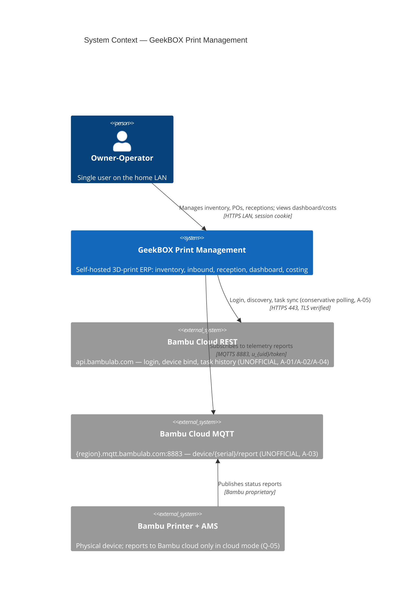
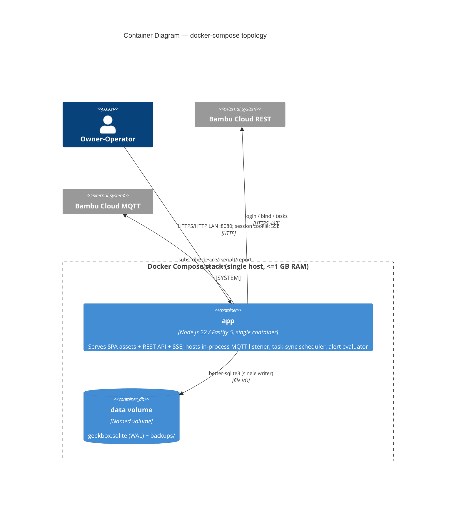
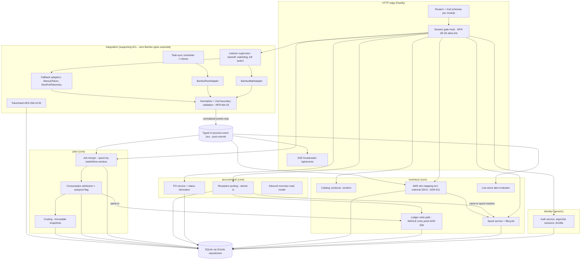
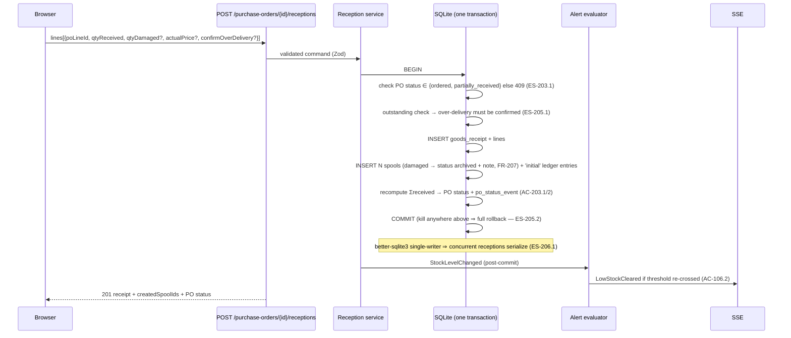
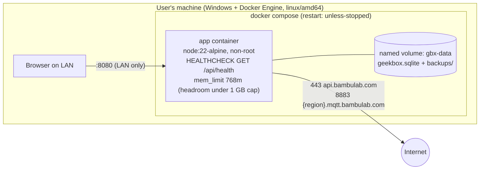

# Architecture Documentation: GeekBOX Print Management
**Version**: 1.0
**Authors**: architect (Supreme Team design pipeline, Phase 3)
**Date**: 2026-08-04
**Status**: In Review (pipeline mode — commander owns gatekeeper cycle)
**Template**: Arc42 v9.0
**Companions**: `deliverable_adrs.md` (ADR-001…013), `deliverable_api-contracts.md`, `deliverable_data-model.md`, `deliverable_backend-stack-lock.md`

---

## 1. Introduction and Goals

### 1.1 Requirements Overview
A self-hosted, single-user web application — a lightweight ERP scoped to 3D printing — covering: filament catalog + per-spool inventory with an immutable weight ledger (FR-101–108), purchase orders / inbound logistics / goods reception (FR-201–207), a live Bambu Lab printer dashboard with AMS↔spool mapping via the unofficial Bambu Cloud REST + MQTT APIs (FR-301–308), and cost-per-print from actual consumption (FR-401–406), behind single-account credential auth (FR-001–003). 32 FRs (29 MUST / 3 SHOULD), 28 NFRs. Source of truth: approved SRS v1.0 + Domain Analysis v1.0 (gatekeeper APPROVED 84/100) and Project Plan v2.0 (APPROVED attempt 2).

### 1.2 Quality Goals (ranked — these drove every ADR)
| Priority | Quality Goal | Scenario | Discharged by |
|----------|-------------|----------|---------------|
| 1 | **Ledger reliability** (book of record) | Forced kill during reception/consumption posting → zero partial writes (NFR-RE-03); deduction exactly once per (job, slotRef) across re-syncs (AC-402.2) | ADR-003, ADR-009 |
| 2 | **Integration resilience** | Token expiry, MQTT drop, schema drift → contained in ACL, core app 100% functional (NFR-RE-05, FR-306/307, NFR-MA-02/03) | ADR-004, ADR-006, ADR-012 |
| 3 | **Solo maintainability** | One language, one process, one DB file; zero Bambu imports outside adapter statically enforced (NFR-MA-01/02) | ADR-001, ADR-002 |
| 4 | **Modest performance** | 500 ms p95 at 5k spools/10k jobs/100k ledger rows; 10 s dashboard freshness; ≥10 msg/s/printer; ≤1 GB RAM (NFR-PE-01…04) | ADR-003, ADR-005, ADR-004 |
| 5 | **Local-first portability** | `docker compose up -d` on clean host; all state in named volumes; offline except Bambu (NFR-PO-01…03) | §7 |

### 1.3 Stakeholders
| Role | Expectations from the architecture |
|------|-----------------------------------|
| S01 Owner-operator | Accurate stock/costs; dashboard honest about staleness (NFR-US-03) |
| S02 Self-host operator (same person) | One-command start, restart-policy recovery, one-file backup, LAN-only exposure |
| S03 Downstream phases (designer, engineer, build) | Locked stack, complete API/data contracts, explicit module boundaries, pre-designed fallbacks |
| S04 Bambu Lab Cloud (external, no relationship) | Conservative client behavior (A-05); tolerant parsing (NFR-MA-03) |

---

## 2. Constraints

### 2.1 Technical
| Constraint | Background |
|-----------|-----------|
| Bambu Cloud REST `https://api.bambulab.com` + MQTTS 8883 only (C-01) | User-mandated; endpoints are community-documented assumptions A-01…A-05, unverified until MS-1 spike |
| Docker Compose self-hosted; NOT serverless/Vercel/Azure; persistent listener process (C-02) | User-mandated deployment model |
| Unofficial API ⇒ mandatory ACL, zero Bambu imports outside adapter (C-07, NFR-MA-02/03) | Commander-canonical; CI-enforced static check |
| linux/amd64 OCI images on Windows-hosted Docker (SRS §5.4) | User environment |
| ≤ 1 GB RAM across all compose services (NFR-PE-04) | Right-sized host budget |

### 2.2 Organizational
| Constraint | Impact |
|-----------|--------|
| Solo part-time developer (C-05) | Modular monolith, one language, no ops stack (ADR-001/002/013) |
| Single user, no RBAC (C-03) | Session-cookie auth, no permission model (ADR-007) |
| Zero external spend (C-06) | No managed services anywhere |
| Q-01/Q-02/Q-05/Q-06 PENDING-USER (escalated to admiral) | Architecture valid under all SRS §7.2 fallbacks (ADR-012) |

### 2.3 Conventions
REST + OpenAPI 3.1, RFC 7807 errors; MADR v4 ADRs; C4/Mermaid diagrams; ubiquitous language per DA §5 (Spool ≠ tray; Job ≠ Task; "received" = goods reception, "ingested" = telemetry).

---

## 3. Context and Scope

### 3.1 Business Context (C4 Level 1)



| Communication Partner | Input to system | Output from system |
|----------------------|-----------------|--------------------|
| Owner-operator (browser) | Commands (CRUD, reception, mapping, corrections), credentials | Views, SSE live updates, CSV export, backup file |
| Bambu Cloud REST | Login/token responses, device list, task history (all unverified schemas) | Login requests, polls ≤1/min/endpoint, task sync every ≥30 min |
| Bambu Cloud MQTT | `device/{serial}/report` messages | Subscribe + optional full-status push request |

**Scope boundary**: read-only telemetry — no print initiation, no remote control, no LAN-mode printers, no non-Bambu printers (SRS §1.4). The system exposes no public API.

### 3.2 Technical Context
- Inbound: browser → app, HTTP on LAN port 8080 (configurable); no internet-facing ports.
- Outbound (the only external connectivity, NFR-PO-03): HTTPS 443 → api.bambulab.com; MQTTS 8883 → region broker. TLS certificate verification ON for both (NFR-SE-03).
- MQTT auth: username `u_{uid}`, password = stored access token (decrypted in-process only).

---

## 4. Solution Strategy

| Quality Goal | Approach | Details |
|-------------|----------|---------|
| Ledger reliability | Single-writer SQLite transactions; append-only ledger; DB-constraint idempotency | ADR-003, ADR-009; single ledger-write code path |
| Integration resilience | Hexagonal ACL with primary + fallback adapters; supervised in-process listener; kill switch | ADR-004, ADR-006, ADR-012 |
| Solo maintainability | Modular monolith, one TS codebase, module import allow-list lint | ADR-001, ADR-002 |
| Performance | Embedded DB (no network hop), covered indices, SSE push | ADR-003, ADR-005, data-model §7 |
| Portability | One app container + volumes; migrations at startup; VACUUM INTO backup | §7 |

### Technology Decisions Summary (per Backend Stack Lock)
| Decision Area | Choice | Rationale (ADR) |
|--------------|--------|-----------------|
| Runtime | Node.js 22 LTS + TypeScript 5 (strict, ESM) | ADR-002 |
| Framework | Fastify 5.x | ADR-002 |
| Database | SQLite (WAL) via better-sqlite3 + Drizzle ORM | ADR-003 |
| Validation | Zod v4 (HTTP boundary + ACL boundary) | ADR-002/006 |
| MQTT | MQTT.js 5.x, supervisor-owned backoff | ADR-004 |
| Live updates | SSE | ADR-005 |
| Auth | argon2id + DB-backed session cookie | ADR-007 |
| Secrets | env/secret file; AES-256-GCM token vault | ADR-010 |
| Observability | Pino + /api/health + integration panel (no OTel) | ADR-013 |

---

## 5. Building Block View

### 5.1 Level 1: Containers (C4 Level 2)



| Container | Technology | Responsibility |
|-----------|-----------|---------------|
| **app** | Node 22 / Fastify 5, node:22-alpine, non-root | Everything: static SPA hosting (frontend built in Phase 4 per DG-2), REST API, SSE, domain modules, ACL with MQTT listener + task-sync scheduler (ADR-004), migrations at startup |
| **data volume** | Docker named volume | `geekbox.sqlite` + WAL files + backup artifacts (NFR-PO-02) |

One service by design: the sidecar alternative and its extraction seam are recorded in ADR-004. Frontend container decision belongs to Phase 4; default assumption is static assets served by `app` (no second service needed).

### 5.2 Level 2: `app` Components (C4 Level 3 — modules = bounded contexts)



| Component | Responsibility (key requirement) |
|-----------|---------------------------------|
| Session gate | Global onRequest hook; allow-list {login, setup, health, assets}; 401 otherwise (NFR-SE-06) |
| Ledger write path | The ONLY function that inserts ledger entries; enforces atomicity, floor-at-zero, idempotency, reversal+repost (ADR-009) |
| Reception posting | One transaction: receipt + spools + PO status + status event + alert re-eval (FR-205) |
| AMS mapping | Slot addressing incl. virtual external holder 254:0; verify-flag on tray mismatch; atomic unmap+archive (ADR-011) |
| Job merger | Upsert by `bambu_task_id`, else (printer, ±10 min window); unions MQTT + task-sync data (FR-401) |
| Consumption attribution | Resolves slotRef→mapping→spool at job time; unattributed capture; `consumption.autopost` preview flag (plan §7) |
| Listener supervisor | Owns reconnect backoff (5 s→5 min, jitter), auth-failure handover to reauth flow, bounded drop-oldest queue, watchdog (ADR-004) |
| Normalizer | Zod-tolerant parse; unknown fields ignored, missing→"unknown"+log-once; drift counter (NFR-MA-03) |
| TokenVault | AES-256-GCM encrypt/decrypt, key from env (ADR-010) |

**Dependency rule (CI-enforced)**: `integration/bambu/**` importable only within `integration/`; core modules depend on integration's ports/events only; nothing imports Fastify outside the HTTP edge; only `inventory/ledger` writes `spool_ledger_entry`.

---

## 6. Runtime View

### 6.1 MQTT Telemetry Flow (FR-303/304/305, NFR-PE-02)

```mermaid
sequenceDiagram
    participant B as Bambu MQTT broker
    participant SUP as Listener supervisor
    participant N as Normalizer (ACL)
    participant DB as SQLite
    participant BUS as Event bus
    participant SSE as SSE broadcaster
    participant UI as Browser dashboard

    SUP->>B: CONNECT mqtts:8883 (u_{uid}, token) + SUBSCRIBE device/{serial}/report
    SUP->>B: request full status push (where supported)
    B-->>SUP: report message (raw JSON)
    SUP->>SUP: enqueue (bounded, drop-oldest)
    SUP->>N: dequeue raw payload
    N->>N: Zod tolerant parse — unknown fields ignored, missing → "unknown" (ES-303.1)
    N->>DB: UPSERT telemetry_snapshot (printer_id PK)
    N->>BUS: TelemetrySnapshotUpdated / TrayContentsChanged
    BUS->>DB: mapping verifier: tray mismatch? set verify_flag (AC-305.3)
    BUS->>SSE: telemetry event (throttled ≥1 s/printer)
    SSE-->>UI: event: telemetry {printerId, snapshot}
    Note over UI: renders ≤10 s after receipt (NFR-PE-02); shows capturedAt age (NFR-US-03)
    B--xSUP: connection lost
    SUP->>SUP: backoff 5s×2^n≤5min + jitter; refresh token from vault each attempt (FR-306)
    SUP->>BUS: IntegrationStateChanged(degraded) → SSE banner (ES-304.1)
```

### 6.2 Token Expiry / Re-Authentication (FR-307)

```mermaid
sequenceDiagram
    participant RESTA as BambuRestAdapter
    participant SUP as Supervisor
    participant CL as cloud_link (DB)
    participant BUS as Bus/SSE
    participant U as User
    RESTA--xRESTA: REST 401 (or MQTT CONNACK auth failure)
    RESTA->>SUP: AuthRejected
    SUP->>RESTA: attempt opportunistic refresh (if refresh token present — A-01 "no documented contract")
    alt refresh succeeds
        RESTA->>CL: store new token (AES-256-GCM)
        SUP->>SUP: resume normally
    else refresh unavailable/fails
        SUP->>SUP: STOP MQTT reconnect + suspend REST polling (ES-306.1 — no login hammering)
        SUP->>CL: state = reauth_required
        SUP->>BUS: IntegrationStateChanged(reauth_required) → dashboard banner + settings prompt (AC-307.1)
        Note over U: inventory/procurement/costing fully functional throughout (AC-307.3, NFR-RE-05)
        U->>RESTA: re-link (password → possible code challenge → token) or manual token (ADR-012)
        RESTA->>CL: store token; state = linked
        SUP->>SUP: MQTT + REST resume automatically (AC-307.2)
    end
```

### 6.3 Goods Reception (FR-205/206, NFR-RE-03)



### 6.4 Consumption Deduction (FR-401/402/404, RISK-005/007)

```mermaid
sequenceDiagram
    participant SRC as Task sync / MQTT completion / Manual entry
    participant JM as Job merger
    participant CONS as Consumption attribution
    participant MAP as ams_slot_mapping
    participant LW as Ledger write path (single entry point)
    participant DB as SQLite (one transaction)
    participant COST as Costing
    SRC->>JM: TaskRecord / PrintJobObservedComplete (normalized)
    JM->>DB: UPSERT print_job by bambu_task_id (else printer+time-window match) — AC-401.1, AC-308.2
    JM->>CONS: job gained usage data
    CONS->>MAP: resolve slotRef → spool (incl. external "254:0" — AC-305.5)
    alt mapping exists & autopost ON
        CONS->>LW: RecordConsumption(spoolId, grams|mm→g via density(ES-402.1), jobId, slotRef)
        LW->>DB: BEGIN; INSERT usage row upsert UNIQUE(job_id,slot_ref) — duplicate ⇒ no-op (AC-402.2)
        DB->>DB: INSERT ledger entry (floor-at-0, over_consumption flag, auto-deplete — AC-103.3)
        DB->>DB: UPDATE spool.remaining = balance_after; link usage.ledger_entry_id; COMMIT (ES-103.1)
        LW->>COST: FilamentConsumptionRecorded
        COST->>DB: INSERT cost_calculation snapshot (frozen inputs — AC-404.2)
    else no mapping at job time
        CONS->>DB: usage row attributed=0 (ES-402.2) — later /attribute posts via same LW path
    else autopost OFF (D5 preview)
        CONS->>DB: usage computed, shown "pending" via SSE jobUpdate(consumption_pending)
    end
```

### 6.5 Account Linking incl. Code Challenge (FR-301, ADR-012/Q-06)
`POST /integration/link` → BambuRestAdapter `POST /v1/user-service/user/login` (A-01). Response paths: token ⇒ encrypt+store, state=linked, start listener; code-required ⇒ 202 `{challengeId}` → user submits `/link/verify` → token stored; failure ⇒ raw error logged, sanitized 502, **no partial token state** (ES-301.1); schema mismatch ⇒ "integration schema mismatch" report, never a crash (ES-301.2). Escape hatch: `/link/manual-token` bypasses login entirely.

---

## 7. Deployment View

### 7.1 Infrastructure Topology



Compose skeleton (D1 deliverable, normative shape):
```yaml
services:
  app:
    image: geekbox/app:${TAG}        # versioned tags only, never bare latest (plan §7)
    restart: unless-stopped           # NFR-RE-01
    ports: ["8080:8080"]             # LAN only; no other inbound
    env_file: .env                    # SESSION_SECRET, TOKEN_ENCRYPTION_KEY, etc. (NFR-SE-05)
    volumes: [ "gbx-data:/data" ]     # NFR-PO-02
    mem_limit: 768m                   # NFR-PE-04 enforcement with margin
    healthcheck: { test: ["CMD", "node", "healthcheck.js"], interval: 30s, retries: 3 }
volumes: { gbx-data: {} }
```

### 7.2 Environment Matrix
| Environment | Purpose | Infrastructure | Notes |
|------------|---------|---------------|-------|
| Development | Local dev | `pnpm dev` + local SQLite file, or compose | Vitest + fixture contract tests |
| CI | lint → typecheck → test → build → image (plan D1) | GitHub Actions, linux/amd64 build | NFR-MA-02 static dependency check gates merge |
| Production | The user's single host | Docker Compose as above | Migrations at startup; release procedure per plan §7 (backup → pull → up → smoke) |

No staging: single-user self-host; the release smoke checklist + 24 h observation (plan §7) fills that role. **Secrets**: `.env`/secret file only — `SESSION_SECRET`, `TOKEN_ENCRYPTION_KEY` (32 B), optional `PORT`, `MQTT_REGION` override; never in images/layers/logs (NFR-SE-05, image-scan gate in D6). **DR/backup**: `GET /api/backup` (VACUUM INTO) + documented CLI; restore = place file + start (drill is a D6 gate, NFR-RE-04).

---

## 8. Crosscutting Concepts

### 8.1 Authentication & Authorization
ADR-007: argon2id; opaque DB-backed session cookie (HttpOnly, SameSite=Lax, Secure-when-HTTPS, sliding 7-day expiry); global deny-by-default gate with explicit allow-list; login throttling 10/15 min → ≥30 s delay; first-run setup route self-disables. No RBAC (C-03).

### 8.2 Error Handling
RFC 7807 on every error; stable `code` field per domain error; generic auth errors (AC-001.2); Bambu upstream failures map to 502 with sanitized detail + raw server-side log (ES-301.1); global Fastify error handler is the single formatting point; SSE errors degrade to polling (ADR-005).

### 8.3 Logging & Observability (ADR-013)
Pino JSON to stdout (docker logs); redaction serializers for password/token/cookie fields; log-once-per-field-per-session for drift (ES-303.1); `/api/health` component detail; FR-306 status panel is the user-facing monitor. No OTel (Dev-2).

### 8.4 Configuration
Zod-validated env at startup (fail fast); runtime settings (region, kill switch, sync interval, cost rates, thresholds) live in DB and are UI-editable; env overrides DB for region (ADR-012). Feature flags: exactly two — `consumption.autopost` (temporary, D5) and `integration.enabled` (permanent) per plan §7.

### 8.5 Caching
None beyond in-memory latest snapshots and SQLite page cache — deliberate right-sizing; NFR-PE-01 headroom makes caching layers unjustified complexity.

### 8.6 Internationalization
Single locale/currency v1 (A-07); currency code display-only in settings; all money in integer minor units so a v2 currency field is additive.

### 8.7 Bambu ACL Rules (C-07)
See ADR-006: ports (`BambuCloudGateway`, `TelemetrySource`, `TokenVault`), primary + fallback adapters, Zod boundary validation, fixture-based contract tests from MS-1 spike, CI static check (zero Bambu imports outside `integration/`).

### 8.8 Idempotency & Ledger Rules
See ADR-009: single ledger-write path; DB-level `UNIQUE(job_id, slot_ref)`; append-only entries; reversal+repost corrections; floor-at-zero + auto-deplete.

### 8.9 GK-M1 / FR-305 Amendment & ES-107.1 Resolution (DG-1 P5)
Per ADR-011 — normative here: every tracked printer has a **virtual external-spool holder at slot address `254:0`**, mappable exactly like an AMS slot (new AC-305.4); external/single-spool job usage deducts from that mapping, unmapped ⇒ unattributed (new AC-305.5). ES-107.1 is resolved to **atomic unmap-then-archive after a single confirmation**. Verdict minors: m2 (CloudLink/AmsSlotMapping context ownership) and m4 (FR-102↔FR-205 directionality) fixed in `deliverable_data-model.md` §1; planner n1 (manual consumption path under RISK-002) addressed in ADR-009 §5.

---

## 9. Architecture Decisions
Index (full MADR records in `deliverable_adrs.md`): ADR-001 modular monolith · ADR-002 Node/TS/Fastify stack · ADR-003 SQLite+Drizzle · ADR-004 in-process listener (DG-4) · ADR-005 SSE (DG-3) · ADR-006 Bambu ACL + fallback adapters · ADR-007 session auth · ADR-008 telemetry retention (DG-6) · ADR-009 ledger/idempotency · ADR-010 token encryption · ADR-011 external-spool slot (GK-M1) + ES-107.1 · ADR-012 pending-question fallback provisions (DG-1 P7) · ADR-013 right-sized observability. All Accepted 2026-08-04.

---

## 10. Quality Requirements (Quality Tree → Tactics)

| NFR | Scenario/Threshold | Architecture Tactic | Verified (plan) |
|-----|-------------------|--------------------|-----------------|
| NFR-PE-01 | <500 ms p95 @ seed volumes | Embedded SQLite, covered indices, no N+1 (Drizzle explicit joins) | D6 seeded run |
| NFR-PE-02 | ≤10 s dashboard freshness | SSE push, ≥1 s/printer throttle | D3 integration test |
| NFR-PE-03 | ≥10 msg/s/printer, bounded memory | Drop-oldest bounded queue; latest-snapshot UPSERT | D6 replay load test |
| NFR-PE-04 | ≤1 GB RAM | Single container, mem_limit 768m, no DB/broker/metrics services | D6 24 h soak |
| NFR-RE-01 | Crash recovery <60 s | restart: unless-stopped + healthcheck; sessions in DB | D6 kill test |
| NFR-RE-02 | MQTT reconnect ≤5 min after network restore | Supervisor backoff cap 5 min + jitter | D3 network-cut drill |
| NFR-RE-03 | Zero partial writes | Single-tx postings (6.3/6.4); WAL durability | D2/D4 crash injection |
| NFR-RE-04 | One-command backup/restore | VACUUM INTO endpoint + CLI | D6 restore drill |
| NFR-RE-05 | 100% core function w/ integration down | Module isolation + kill switch + error-contained supervisor | D3 walkthrough w/ integration disabled |
| NFR-SE-01…07 | (see §8.1, ADR-007/010) | argon2id; AES-256-GCM vault; TLS verify; cookie flags; env secrets; deny-by-default gate; throttle | D6 security pass |
| NFR-MA-01 | ≥80% domain coverage | Domain modules pure of framework deps; single ledger path is highly testable | CI coverage |
| NFR-MA-02/03 | Zero Bambu imports outside adapter; drift tolerance | CI dependency rule; Zod-tolerant normalizer; fixtures corpus | CI static check + contract tests |
| NFR-PO-01…03 | compose up on clean host; volumes; offline-capable | §7 topology | D6/clean-host test |
| NFR-US-01…03, NFR-CO-01/02 | Responsive/AA/staleness; browsers; models | Data contracts expose capturedAt/staleness + nullable model fields; UI concerns → Phase 4 (designer, m5) | D6 audits |

---

## 11. Risks and Technical Debt

| Risk/Debt | Description | Priority | Mitigation Plan |
|-----------|-------------|----------|----------------|
| A-01…A-05 unverified (RISK-001) | Entire integration rests on community docs | Critical | MS-1 spike before D1 exit; fallback adapters pre-designed (ADR-006/012); ACL blast-radius containment |
| Q-05 LAN-only possibility (RISK-002) | Cloud API sees nothing | High | Kill switch + module isolation keep v1 valuable; descope path per plan RISK-002 |
| Single-process coupling (ADR-004) | Hard process fault takes API + listener down together | Medium | Restart policy <60 s; documented sidecar extraction seam if D6 soak fails |
| SQLite multi-process ceiling (ADR-003) | Listener extraction would need WAL multi-process care | Low | Seam documented; Postgres swap path via Drizzle |
| Denormalized spool balance | Requires invariant test balance==last entry | Low | Property test in NFR-MA-01 suite |
| Accepted debt: no OTel, no staging, no cache layer | Deliberate right-sizing (ADR-013, §7.2, §8.5) | Accepted | Reinstatement paths documented per ADR |

---

## 12. Glossary
Authoritative glossary: Domain Analysis §5 (24 terms) — adopted verbatim. Architecture-added terms: **slotRef** (`"{unit}:{slot}"` slot address; external holder = `"254:0"`), **ledger write path** (the single code path inserting ledger entries), **kill switch** (`integration.enabled` runtime flag), **drift counter** (ACL metric of tolerated schema deviations), **supervisor** (in-process listener lifecycle owner).
