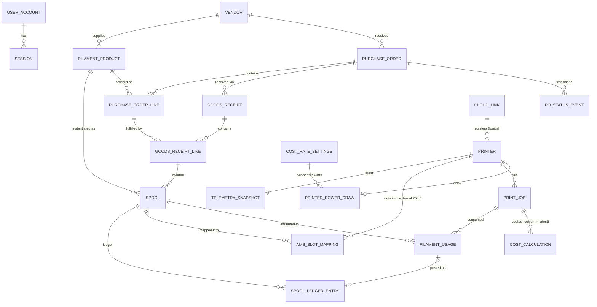

# DATA MODEL: GeekBOX Print Management
**Version**: 2.0 | **Authors**: architect (Phase 3, attempt 2) | **Date**: 2026-08-04
**Engine**: SQLite (WAL) per ADR-003 | **Migrations**: drizzle-kit, applied at app startup (plan §7 step 4)
**Sources**: Domain analysis §4 entities (authoritative), SRS FR/NFR constraints, ADR-009 (ledger), ADR-011 (external slot)

Conventions: `TEXT` UUIDs (v7) as PKs; `INTEGER` unix-ms timestamps (`*_at`); money as `INTEGER` minor units (öre/cents) noted `_minor`; weights as `REAL` grams; booleans as `INTEGER` 0/1. All FKs enforced (`foreign_keys=ON`). Soft delete = `archived` flag (FR-101/FR-201).

---

## 1. ERD

Context ownership (fixes verdict minor **m2** drift): `AmsSlotMapping` is owned by **Filament Inventory** (it binds spools; it *consumes* Integration tray observations, never the reverse); `CloudLink` is owned by **Printer Integration**. Dependency directionality (fixes **m4**): FR-205 depends on the Spool *schema* (FR-102); reception-created spools are one *source* of spool rows — the schema dependency is one-way (Procurement → Inventory), no cycle.

---

## 2. Identity & Access (generic context)

### user_account (singleton — FR-001)
| Column | Type | Constraints |
|--------|------|-------------|
| id | TEXT | PK |
| username | TEXT | NOT NULL UNIQUE |
| password_hash | TEXT | NOT NULL — argon2id (ADR-007) |
| created_at / updated_at | INTEGER | NOT NULL |

### session (FR-002)
| Column | Type | Constraints |
|--------|------|-------------|
| token_hash | TEXT | PK — SHA-256 of opaque cookie token |
| user_id | TEXT | NOT NULL FK user_account |
| created_at / last_seen_at / expires_at | INTEGER | NOT NULL; sliding expiry |

---

## 3. Filament Inventory (core — book of record)

### vendor (FR-201; shared kernel with Procurement)
| Column | Type | Constraints |
|--------|------|-------------|
| id | TEXT | PK |
| name | TEXT | NOT NULL |
| url / notes | TEXT | NULL |
| lead_time_days | INTEGER | NULL, ≥ 0 |
| archived | INTEGER | NOT NULL DEFAULT 0 |

### filament_product (FR-101, FR-106)
| Column | Type | Constraints |
|--------|------|-------------|
| id | TEXT | PK |
| material | TEXT | NOT NULL CHECK IN ('PLA','PETG','ABS','TPU','ASA','PC','PA','SUPPORT','OTHER') |
| color_name | TEXT | NOT NULL |
| color_hex | TEXT | NULL, `#RRGGBB` |
| vendor_id | TEXT | NOT NULL FK vendor |
| diameter_mm | REAL | NOT NULL DEFAULT 1.75 CHECK IN (1.75, 2.85) |
| nominal_net_weight_g | INTEGER | NOT NULL CHECK > 0 |
| default_price_minor | INTEGER | NOT NULL DEFAULT 0 CHECK ≥ 0 |
| density_g_cm3 | REAL | NOT NULL — material default seeded, overridable (ES-402.1 conversion) |
| low_stock_threshold_g | INTEGER | NULL (opt-in, FR-106 ES-106.1) |
| low_stock_min_spools | INTEGER | NULL |
| sku / notes | TEXT | NULL |
| archived | INTEGER | NOT NULL DEFAULT 0 |

Seeded density defaults (documented per FR-402): PLA 1.24, PETG 1.27, ABS 1.04, TPU 1.21, ASA 1.07, PC 1.20, PA 1.14, SUPPORT 1.20, OTHER 1.20 g/cm³.

### spool (FR-102/103/107; DA §4 aggregate root)
| Column | Type | Constraints |
|--------|------|-------------|
| id | TEXT | PK |
| label | TEXT | NOT NULL UNIQUE — printable `S-{seq}` (AC-102.1) |
| product_id | TEXT | NOT NULL FK filament_product |
| initial_net_weight_g | INTEGER | NOT NULL CHECK (> 0 AND ≤ 20000) (ES-102.1) |
| remaining_net_weight_g | REAL | NOT NULL CHECK ≥ 0 — denormalized last ledger balance (ADR-009 §1) |
| tare_weight_g | INTEGER | NULL (FR-104) |
| purchase_price_minor | INTEGER | NULL — falls back to product default, valued "estimated" (ES-108.1) |
| source | TEXT | NOT NULL CHECK IN ('goods_reception','manual') |
| goods_receipt_line_id | TEXT | NULL FK goods_receipt_line — traceability (AC-205.2) |
| status | TEXT | NOT NULL CHECK IN ('in_stock','in_use','depleted','archived') |
| acquired_at | INTEGER | NOT NULL |
| notes | TEXT | NULL — damage notes on reception discrepancies (FR-207) |

### spool_ledger_entry (FR-103 — immutable, append-only; no UPDATE/DELETE path in repository API)
| Column | Type | Constraints |
|--------|------|-------------|
| id | TEXT | PK |
| spool_id | TEXT | NOT NULL FK spool |
| type | TEXT | NOT NULL CHECK IN ('initial','consumption','manual_adjustment','reversal') |
| delta_g | REAL | NOT NULL — negative = deduction |
| balance_after_g | REAL | NOT NULL CHECK ≥ 0 |
| job_id | TEXT | NULL FK print_job |
| slot_ref | TEXT | NULL — `"{unit}:{slot}"`, external = `"254:0"` (ADR-011) |
| reverses_entry_id | TEXT | NULL FK spool_ledger_entry — set iff `type='reversal'`; partial `UNIQUE(reverses_entry_id) WHERE reverses_entry_id IS NOT NULL` (an entry can be reversed at most once) |
| estimated | INTEGER | NOT NULL DEFAULT 0 — length-converted / default-priced (ES-402.1) |
| over_consumption | INTEGER | NOT NULL DEFAULT 0 (AC-103.3) |
| note | TEXT | NULL |
| created_at | INTEGER | NOT NULL |

**Invariants (enforced in the single ledger-write transaction, ADR-009):** `spool.remaining_net_weight_g == balance_after_g` of newest entry; entry insert + balance update + optional status transition (depleted) are one transaction (ES-103.1); floor-at-zero with `over_consumption=1`.
**Exactly-once & correction rule (v2 — reconciles gatekeeper M1; normative, mirrored in ADR-009 §1/§3):** the ledger carries **no uniqueness constraint over (spool_id, job_id, slot_ref, type)** — the v1 partial backstop index is REMOVED because it collided with the FR-405 reverse-and-repost flow (the reposted `consumption` entry duplicates the never-deleted original's tuple on a same-spool correction). Entry *identity*, not the tuple, is the uniqueness carrier. FR-402 exactly-once is anchored at DB level by three constraints: (a) `filament_usage.UNIQUE(job_id, slot_ref)` (§6) — at most one usage row per job-slot, surviving restarts/re-syncs; (b) `filament_usage.ledger_entry_id` UNIQUE FK — each usage references exactly one **live** consumption entry and no two usages share one; (c) `UNIQUE(reverses_entry_id) WHERE NOT NULL` (above) — an entry can be reversed at most once, so a replayed correction cannot double-reverse. **Correction transaction (FR-405 AC-405.2, one SQLite transaction):** insert `reversal` (delta = −original.delta_g, `reverses_entry_id` = original.id) → insert corrected `consumption` entry (same spool permitted) → repoint `filament_usage.ledger_entry_id` to the new entry → update denormalized balance. **Invariant (NFR-MA-01 test suite):** a `consumption` entry with a job_id is live iff some `filament_usage.ledger_entry_id` references it; every non-live consumption entry is reversed exactly once; the newest `balance_after_g` equals `spool.remaining_net_weight_g`.

### ams_slot_mapping (FR-305 as amended per GK-M1; owned by Inventory)
| Column | Type | Constraints |
|--------|------|-------------|
| id | TEXT | PK |
| printer_id | TEXT | NOT NULL FK printer |
| unit_index | INTEGER | NOT NULL CHECK ((0–3) OR 254) — **254 = virtual external-spool holder (ADR-011)** |
| slot_index | INTEGER | NOT NULL CHECK (0–3; must be 0 when unit_index=254) |
| spool_id | TEXT | NOT NULL FK spool |
| mapped_at | INTEGER | NOT NULL |
| verify_flag | INTEGER | NOT NULL DEFAULT 0 — set on TrayContentsChanged mismatch (AC-305.3), cleared on confirm/remap |
| verify_reason | TEXT | NULL — 'tray_mismatch','spool_unavailable' (ES-305.1) |
| | | `UNIQUE(printer_id, unit_index, slot_index)`; `UNIQUE(spool_id)` (a spool mounts one place at a time) |

Rules: creating a mapping sets spool → in_use; deleting returns it to in_stock unless depleted (AC-107.1, DA §4); archive-while-mapped executes atomic unmap-then-archive in one transaction (**ES-107.1 resolved**, ADR-011).

---

## 4. Procurement & Reception (core)

### purchase_order (FR-202/203)
| Column | Type | Constraints |
|--------|------|-------------|
| id | TEXT | PK |
| vendor_id | TEXT | NOT NULL FK vendor |
| status | TEXT | NOT NULL CHECK IN ('draft','ordered','partially_received','received','cancelled') |
| order_date | INTEGER | NOT NULL |
| expected_arrival | INTEGER | NULL — defaults order_date + vendor.lead_time_days (AC-201.2); NULL sorts last, "no ETA" (ES-204.1) |
| external_ref / notes | TEXT | NULL |
| shipping_cost_minor | INTEGER | NULL CHECK ≥ 0 |
| created_at / updated_at | INTEGER | NOT NULL |

### po_status_event (FR-203 timestamped transitions)
| Column | Type | Constraints |
|--------|------|-------------|
| id | TEXT | PK |
| purchase_order_id | TEXT | NOT NULL FK |
| from_status / to_status | TEXT | NOT NULL |
| occurred_at | INTEGER | NOT NULL |

### purchase_order_line (FR-202)
| Column | Type | Constraints |
|--------|------|-------------|
| id | TEXT | PK |
| purchase_order_id | TEXT | NOT NULL FK |
| product_id | TEXT | NOT NULL FK filament_product |
| quantity_ordered | INTEGER | NOT NULL CHECK > 0 (ES-202.2) |
| unit_price_minor | INTEGER | NOT NULL CHECK ≥ 0 |
| expected_weight_override_g | INTEGER | NULL CHECK > 0 |

`quantity_received` is **derived** (SUM of receipt lines) — never stored, cannot drift. Status derivation (FR-203): partially_received when 0 < Σreceived < Σordered; received when Σreceived ≥ Σordered; recomputed inside the reception transaction.

### goods_receipt / goods_receipt_line (FR-205/206/207)
goods_receipt: `id` PK, `purchase_order_id` FK NOT NULL, `received_at` NOT NULL, `notes` NULL.
| goods_receipt_line | Type | Constraints |
|--------|------|-------------|
| id | TEXT | PK |
| goods_receipt_id | TEXT | NOT NULL FK |
| po_line_id | TEXT | NOT NULL FK purchase_order_line |
| quantity_received | INTEGER | NOT NULL CHECK > 0 |
| quantity_damaged | INTEGER | NOT NULL DEFAULT 0 CHECK (≥ 0 AND ≤ quantity_received) (ES-207.1) |
| actual_unit_price_minor | INTEGER | NULL — overrides PO line price for created spools |
| over_delivery | INTEGER | NOT NULL DEFAULT 0 — confirmed flag (ES-205.1) |
| discrepancy_note | TEXT | NULL |

Created spools link back via `spool.goods_receipt_line_id` (AC-205.2). **Reception posting transaction (FR-205, NFR-RE-03):** insert receipt + lines + N spools (+ initial ledger entries) + PO status recompute + status event + low-stock re-evaluation — one SQLite transaction; better-sqlite3 serialization discharges ES-206.1.

---

## 5. Printer Integration (supporting, ACL)

### cloud_link (singleton — FR-301/306/307; DA §4)
| Column | Type | Constraints |
|--------|------|-------------|
| id | TEXT | PK |
| bambu_uid | TEXT | NULL |
| access_token_enc / refresh_token_enc | BLOB | NULL — AES-256-GCM(iv‖tag‖ct), ADR-010; **account password never stored** |
| state | TEXT | NOT NULL CHECK IN ('unlinked','linked','reauth_required') |
| auth_mode | TEXT | NOT NULL CHECK IN ('password','manual_token') — ADR-012/Q-06 fallback |
| mqtt_region | TEXT | NOT NULL DEFAULT 'us' — or full custom hostname (ADR-012/Q-01) |
| integration_enabled | INTEGER | NOT NULL DEFAULT 1 — permanent kill switch (ADR-012/Q-05) |
| linked_at / token_issued_at | INTEGER | NULL |
| last_rest_success_at / mqtt_connected_since / last_mqtt_message_at | INTEGER | NULL — health panel (FR-306) |
| last_error_class | TEXT | NULL |

### printer (FR-302)
| Column | Type | Constraints |
|--------|------|-------------|
| id | TEXT | PK |
| serial | TEXT | NOT NULL UNIQUE — dev_id |
| name / model | TEXT | name NOT NULL; model NULL (manual registrations may lack it — ADR-012/Q-02) |
| registration | TEXT | NOT NULL CHECK IN ('discovered','manual') |
| tracked | INTEGER | NOT NULL DEFAULT 1 |
| online_flag | INTEGER | NOT NULL DEFAULT 0 |
| last_seen_at | INTEGER | NULL |

### telemetry_snapshot (latest-per-printer — ADR-008 default; UPSERT on ingest)
| Column | Type | Constraints |
|--------|------|-------------|
| printer_id | TEXT | PK FK printer — exactly one row per printer |
| captured_at | INTEGER | NOT NULL — staleness derives from this (FR-304) |
| printer_state | TEXT | NOT NULL CHECK IN ('idle','printing','paused','error','offline','unknown') |
| task_name | TEXT | NULL |
| progress_pct / current_layer / total_layers / remaining_time_min | REAL/INT | NULL — all nullable, NFR-MA-03 |
| nozzle_temp_c / bed_temp_c / chamber_temp_c | REAL | NULL — chamber absent on some models (NFR-CO-02) |
| ams_json | TEXT | NULL — normalized JSON: units[] → slots[] {slotIndex, trayType?, trayColorHex?, remainingPct?} (internal shape, NOT raw Bambu payload) |

`ams_json` holds the **normalized internal** tray model (read model, latest-only, schema versioned `v:1`); relational decomposition is unjustified for a single-row-per-printer read model. **DG-6 fallback (pre-designed, additive)**: optional `telemetry_history(printer_id, captured_at, printer_state, progress_pct, nozzle_temp_c, bed_temp_c, chamber_temp_c)` append-only, 1 row/printer/min downsample, 30-day purge — added by one migration + one ingest tee if the user opts into charts (ADR-008).

---

## 6. Print Jobs & Costing (core)

### print_job (FR-401)
| Column | Type | Constraints |
|--------|------|-------------|
| id | TEXT | PK |
| source | TEXT | NOT NULL CHECK IN ('task_sync','telemetry','manual') — first observer; merge unions data (AC-401.1) |
| bambu_task_id | TEXT | NULL **UNIQUE** — the FR-308/FR-401 idempotent upsert key |
| printer_id | TEXT | NULL FK printer |
| job_name | TEXT | NOT NULL DEFAULT '' |
| started_at / ended_at | INTEGER | NULL |
| duration_min | REAL | NULL |
| outcome | TEXT | NOT NULL CHECK IN ('success','failed','cancelled','unknown') |
| usage_status | TEXT | NOT NULL CHECK IN ('reported','estimated','unknown','manual') (ES-401.1) |
| created_at / updated_at | INTEGER | NOT NULL |

### filament_usage (FR-402 — the idempotency anchor, ADR-009 §3)
| Column | Type | Constraints |
|--------|------|-------------|
| id | TEXT | PK |
| job_id | TEXT | NOT NULL FK print_job |
| slot_ref | TEXT | NOT NULL — `"{unit}:{slot}"`; external `"254:0"`; manual entries use `"manual:{n}"` |
| spool_id | TEXT | NULL FK spool — resolved at attribution time |
| used_g | REAL | NULL CHECK ≥ 0 |
| used_mm | REAL | NULL — length-reported; converted via density (ES-402.1) |
| estimated | INTEGER | NOT NULL DEFAULT 0 |
| attributed | INTEGER | NOT NULL DEFAULT 0 (ES-402.2) |
| ledger_entry_id | TEXT | NULL UNIQUE FK spool_ledger_entry — references the **live** consumption entry; set when the deduction posts, **repointed to the reposted entry inside an FR-405 correction transaction** (§3 exactly-once rule, ADR-009 §1/§3) |
| | | **`UNIQUE(job_id, slot_ref)`** — exactly-once guard (AC-402.2), a DB constraint surviving restarts/re-syncs |

### cost_rate_settings (singleton — FR-403) & printer_power_draw
cost_rate_settings: `id` PK, `energy_price_per_kwh_minor` NULL, `machine_rate_per_hour_minor` NULL, `currency_code` TEXT NOT NULL DEFAULT 'NOK' (display only, A-07 — **the 'NOK' default is a disclosed assumption pending Q-03** (Phase 4/user owner); editable at any time, affects no calculation), all rates optional CHECK ≥ 0 (ES-403.1).
printer_power_draw: `printer_id` PK FK, `watts` REAL NOT NULL CHECK > 0 (per-printer draw, AC-403.1).

### cost_calculation (FR-404 — immutable snapshot; new row supersedes, never UPDATE)
| Column | Type | Constraints |
|--------|------|-------------|
| id | TEXT | PK |
| job_id | TEXT | NOT NULL FK print_job |
| calculated_at | INTEGER | NOT NULL |
| filament_cost_minor / energy_cost_minor / machine_cost_minor / total_cost_minor | INTEGER | filament+total NOT NULL; energy/machine NULL = "not configured" (AC-403.2) |
| incomplete | INTEGER | NOT NULL DEFAULT 0 (ES-404.1, ES-406.1) |
| inputs_snapshot_json | TEXT | NOT NULL — per-spool unit_cost_per_g, rates, watts used (AC-404.2 frozen inputs) |
| superseded | INTEGER | NOT NULL DEFAULT 0 — prior rows flagged on explicit recalculation |

Current cost of a job = its newest non-superseded row (no FK on print_job → no m2-style drift; full precision stored in inputs snapshot, rounding at display per AC-404.1).

---

## 7. Indices (NFR-PE-01 support)

- `spool(product_id, status)` — stock aggregation/filters (FR-105)
- `spool_ledger_entry(spool_id, created_at DESC)` — ledger view newest-first (AC-103.2)
- `purchase_order(status, expected_arrival)` — inbound overview sort (FR-204)
- `goods_receipt_line(po_line_id)` — outstanding-quantity derivation
- `print_job(printer_id, started_at DESC)`, `print_job(outcome)` — history filters (FR-406)
- `filament_usage(job_id)`, `filament_usage(spool_id)` — cost/attribution joins
- Uniques defined inline above double as lookup indices (`bambu_task_id`, `serial`, mapping tuple)

## 8. Data Flow Across Contexts, Retention, Migration

- **Flows** (transactionally consistent, same DB — DA §3.2): Reception → Inventory (spool creation, same tx); Jobs → Inventory (ledger write via single write-path, same tx); Integration → Jobs/Inventory (normalized events only; integration NEVER writes spools/ledger directly — tray observations set `verify_flag` at most).
- **Retention**: business records retained indefinitely (single-user ERP history is the product); telemetry latest-only (ADR-008); sessions purged on expiry sweep; no PII beyond the user's own account and Bambu tokens (encrypted, ADR-010) — no regulatory retention obligations (C-06).
- **Migration strategy**: drizzle-kit generated SQL migrations, versioned in repo, applied at startup; backward-compatible within a release when feasible, else release notes flag "restore-to-rollback" (plan §7 step 4). Rollback = previous image tag + step-2 backup restore (NFR-RE-04). D1 migration baseline = §2–§6 tables minus the DG-6 fallback table.
- **Backup**: `VACUUM INTO` a timestamped file in the backup volume, exposed as `GET /api/backup` + documented CLI one-liner — single-command, restorable (NFR-RE-04); backups documented as sensitive (RISK-009).
